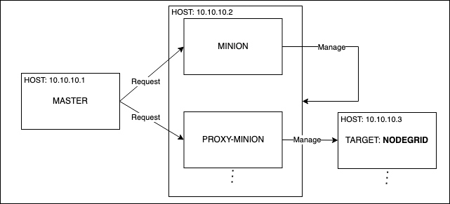

# Nodegrid Salt Proxy Module

On this repository you will find the Proxy Minion module for managing ZPE's Nodegrid OS hosts.

This proxy minion enables Nodegrid OS hosts to be treated individually like a Salt Minion.

Salt's "Proxy Minion" functionality enables you to designate another machine to host a minion process that "proxies" communication from the Salt Master. The master does not know nor care that the target is not a "real" Salt Minion.

More in-depth conceptual reading on [Proxy Minions](https://docs.saltproject.io/en/latest/topics/proxyminion/index.html#proxy-minion) can be found in the Proxy Minion section of Salt's documentation.

> This module depends on a pre-installed Salt environment - [Salt Installation documentation](https://docs.saltproject.io/en/latest/topics/installation/index.html)

# Pillar

Proxy minions get their configuration from Salt's Pillar. Every proxy must have an instance in the Pillar file and a reference in the Pillar top file that matches the proxy ID.

At a minimum for communication with the Nodegrid host, the pillar should look like this:
```
proxy:
  proxytype: nodegrid
  host: <ip or hostname of nodegrid host>
  username: <nodegrid administrator username>
  password: <password>
```

# Nodegrid Proxy Module Available Functions

Please check the following documentation for functions specifications:
- [salt.proxy.nodegrid](docs/FUNCTIONS.md)

# Nodegrid Proxy Module Examples

Please check the following documentation for examples:
- [ZPE Salt Examples](docs/EXAMPLES.md)


# Salt Installation

To continue on this section, an existent Salt installation is necessary.
More information can be found in the official [Installation](https://docs.saltproject.io/en/latest/topics/installation/index.html) section of Salt's documentation.

If you don't have an environment yet, you can check the guides prepared for Ubuntu and Nodegrid OS below:
- [Salt installation on Ubuntu](installation/README.md#salt-installation-on-ubuntu)
- [Salt installation on Nodegrid OS](installation/README.md#salt-installation-on-nodegrid-os)

> Dependency: python-pexpect

# Nodegrid Proxy Module Installation

On the SALT MASTER, connect to SSH and go to shell.

Create folder to modules installation, default is `/srv/salt/`:
```shell script
sudo mkdir -p /srv/salt/_proxy
sudo mkdir -p /srv/salt/_modules
```

Clone the example repository and install:
```shell script
git clone https://github.com/ZPESystems/zpe.nodegrid_examples.git
cd zpe.nodegrid_examples/salt
sudo cp installation/salt/proxy/nodegrid.py /srv/salt/_proxy/
sudo cp installation/salt/modules/nodegrid.py /srv/salt/_modules/
```

# Nodegrid Proxy Module Configuration

This section presents the configuration for a Salt Master, Minion, Proxy-Minion and Target. Check the diagram below for a better understanding.



## Step 1 - On Master: Configure and Run master
For each **file** add the following **contents**.

Edit the '/etc/salt/master' file to include the path to the file repository and pillar:
```
file_roots:
  base:
    - /srv/salt/
pillar_roots:
  base:
    - /srv/pillar
```

Create a pillar directory for the pillar files configuration:
```
sudo mkdir -p /srv/pillar
```

Create the file '/srv/pillar/top.sls'  to map the devices details with the proxy name:
```
base:
  'nodegrid_host':
    - nodegrid_host
  'nodegrid_host2':
    - nodegrid_host2
```

In '/srv/pillar/nodegrid_host.sls' and '/srv/pillar/nodegrid_host2.sls' map the device details with the proxy name:
```
proxy:
  proxytype: nodegrid
  host: 10.10.10.3
  username: <nodegrid administrator username>
  password: <password>
```

Run the SALT MASTER via the following command:
```
sudo salt-master -d --log-file /var/log/salt-master.log --log-file-level=debug -d
```

After storing the device information in the pillar on MASTER, now, configure the PROXY.

## Step 2 - On Minion: Configure and Run
For each **file** add the following **contents**.

Create or edit the proxy conf file '/etc/salt/proxy' to configure MASTER address:
```
master: <ip or hostname of salt-master>
multiprocessing: False # IMPORTANT
```

Create or edit minion conf file '/etc/salt/minion', this is needed for proxy usage:
```
id: salt-minion
master: <ip or hostname of salt-master>
multiprocessing: False # IMPORTANT
```

Run the salt minion first, via the following command:
```shell script
sudo salt-minion --log-file /var/log/salt-minion.log -d
```

## Step 3 - On Master: Accept Minion key

Accept plain minion key:
```shell script
sudo salt-key -a salt-minion -y
```

Test minion communication using test ping:
```shell script
sudo salt salt-minion test.ping
salt-minion:
    True
```

*For the minion environment, install dependency:
```shell script
sudo salt salt-minion pip.install pexpect
```

Sync the newly installed module using the commands below:
```shell script
sudo salt salt-minion saltutil.sync_modules
sudo salt salt-minion saltutil.sync_proxymodules
```

## Step 4 - On Minion: Run Proxy

Run the salt proxy for each device of the pillar file via the following command:
```
sudo salt-proxy --proxyid=nodegrid_host --log-file /var/log/proxy-nodegrid_host.log --log-file-level=debug -d

sudo salt-proxy --proxyid=nodegrid_host2 --log-file /var/log/proxy-nodegrid_host2.log --log-file-level=debug -d
```

## Step 5 - On Master: Accept keys
Yes, now on MASTER again. This is due to security reasons.

For each proxy process, accept the minion key.

Example: accept the key of all the proxies that start with the name nodegrid_host:
```
sudo salt-key -L
Accepted Keys:
Denied Keys:
Unaccepted Keys:
nodegrid_host
nodegrid_host2
Rejected Keys:
sudo salt-key -a nodegrid_host* -y
The following keys are going to be accepted:
Unaccepted Keys:
nodegrid_host
nodegrid_host2
Key for minion nodegrid_host accepted.
Key for minion nodegrid_host2 accepted.
```

To test your salt configuration, use the ping function to show the proxy connectivity status:
```
sudo salt nodegrid_host* nodegrid.ping
nodegrid_host:
    True
nodegrid_host2:
    True
```

# Salt CLI syntax
**Target**: Select the devices to run the command. (Note: [Targeting can be complex](https://docs.saltstack.com/en/latest/topics/targeting/))

**Module**: nodegrid or [others](https://docs.saltproject.io/en/latest/ref/proxy/all/index.html)

**Function**: ping, cli, get_system_about and [more...](docs/FUNCTIONS.md)

**Arguments**: for instance, a CLI command for the cli function
```
# salt <target> <module>.<function> [<arguments>]
sudo salt '*' nodegrid.cli "show /settings/license"
```

## Output example
```
sudo salt nodegrid_host* nodegrid.get_system_about
nodegrid_host:
    system: Nodegrid Manager
    licenses: 1000
    software: v5.6.3 (Aug 24 2022 - 11:59:15)
    cpu: Intel(R) Xeon(R) CPU E5-2698 v4 @ 2.20GHz
    cpu_cores: 1
    bogomips_per_core: 4394.90
    serial_number: 2F0E9B837ECF
    uptime: 1 days,  23 hours,  25 minutes
    boot mode: Legacy
    secure boot: Disabled
    model: VMware Virtual Platform
    revision tag: r1
nodegrid_host2:
    system: Nodegrid Manager
    licenses: 1000
    software: v5.8.2 (Dec 6 2022 - 08:59:05)
    cpu: Intel(R) Xeon(R) CPU E5-2698 v4 @ 2.20GHz
    cpu_cores: 1
    bogomips_per_core: 4394.90
    serial_number: ac5a3642f2873a4d2ef72916cee847bf
    uptime: 10 days,  0 hours,  31 minutes
    boot mode: Legacy
    secure boot: Disabled
    model: VMware Virtual Platform
    revision tag: r1
```

